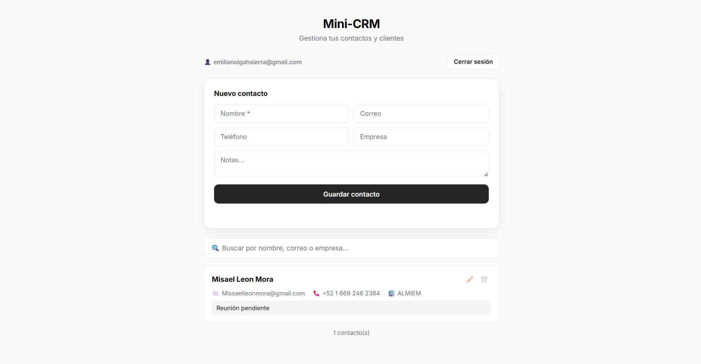
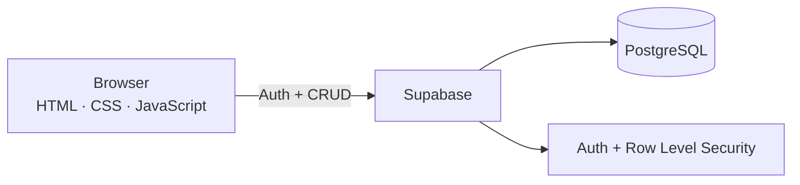

<h1 align="center">Mini-CRM · Full-Stack</h1>

  A full-stack CRM to manage contacts and clients, with user authentication and a cloud database — 
  each user securely manages their own contacts.

  
  
  
  
  
  

  

  <a href="https://mini-crm-nine-psi.vercel.app"><b>Live Demo →</b></a>

---

## Overview

A full-stack CRM where users sign up, log in, and manage their contacts (name, email, phone, company, notes) in the cloud. Data persists across devices, and each user can only see their own contacts — enforced at the database level with Row Level Security.

---

## Features

### Authentication
- Email / password sign up and login (Supabase Auth)
- Registration form with real-time validation, password strength meter and show/hide password

### Contacts (CRUD)
- Create, edit, and delete contacts
- Fields: name, email, phone, company, notes
- Instant search by name, email or company

### Design & UX
- Minimal, SaaS-style interface (light & dark mode)
- Responsive, accessible (keyboard, focus states, ARIA)

---

## Architecture

The browser talks directly to Supabase; security is enforced by Row Level Security policies.

---

## Technologies

| Technology | Purpose |
|------------|---------|
| JavaScript | Application logic and DOM |
| HTML5 / CSS3 | Interface and styling |
| Supabase | Authentication + PostgreSQL database |
| Vercel | Hosting and continuous deployment |
| Git and GitHub | Version control |

---

## How It Works

1. The user signs up or logs in (Supabase Auth issues a secure session).
2. The frontend reads and writes contacts directly through the Supabase client.
3. Row Level Security policies ensure each request only touches the logged-in user's rows.
4. Changes persist instantly in the cloud database.

---

## Author

**Emiliano Lizarraga** — AI-Assisted Developer
Portfolio: https://emilianohsierra.vercel.app · GitHub: https://github.com/emilianohsierra

---

## License

Released under the MIT License.
